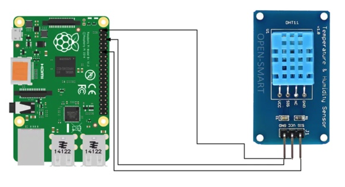

# Plant Parenthood
## A Secure IoT Plant Sensor Application

Tess Lameyer, Lisa Carpenter, Ian Andrewson, Alan Hermanns, Ben Beekman

## DESCRIPTION

Plant Parenthood is a secure server-side application that allows users to remotely gather and post data collected from a variety of sensors (light, temperature, humidity) via a Raspberry Pi.  Two-factor authentication ensures the integrity of data.  Data can be interpreted to make recommendations of common house plants that may thrive under matching environmental conditions.

## PROBLEM DOMAIN

There are many kits avaiable on the market that make it possible to monitor environmental conditions for house plants.  However, the market lacks an application that caters plant recommendations to users based on baseline environmental conditions.  This application aims to fill this gap, providing a secure, simple way to collect data remotely pertaining to the light, temperature, and humidity at a specific location.  These environmental indicators can then be used to customize plant recommendations for each user.  

## VERSION 1.0.0

## LICENSING

Copyright 2020 Pi Party
Permission is hereby granted, free of charge, to any person obtaining a copy of this software and associated documentation files (the "Software"), to deal in the Software without restriction, including without limitation the rights to use, copy, modify, merge, publish, distribute, sublicense, and/or sell copies of the Software, and to permit persons to whom the Software is furnished to do so, subject to the following conditions:

The above copyright notice and this permission notice shall be included in all copies or substantial portions of the Software.

THE SOFTWARE IS PROVIDED "AS IS", WITHOUT WARRANTY OF ANY KIND, EXPRESS OR IMPLIED, INCLUDING BUT NOT LIMITED TO THE WARRANTIES OF MERCHANTABILITY, FITNESS FOR A PARTICULAR PURPOSE AND NONINFRINGEMENT. IN NO EVENT SHALL THE AUTHORS OR COPYRIGHT HOLDERS BE LIABLE FOR ANY CLAIM, DAMAGES OR OTHER LIABILITY, WHETHER IN AN ACTION OF CONTRACT, TORT OR OTHERWISE, ARISING FROM, OUT OF OR IN CONNECTION WITH THE SOFTWARE OR THE USE OR OTHER DEALINGS IN THE SOFTWARE.

## TECH STACK:

- Raspberry Pi 4B
  - Linux
  - Python 3.7.4
- Server
  - Node.js
  - MongoDB

## RAPBERRY PI CONFIGURATION AND SENSOR SETUP
See https://projects.raspberrypi.org/en/projects/raspberry-pi-setting-up for more detailed information about setting up a Raspberry Pi 4

### GENERAL RASPBERRY PI SET UP

- Download the NOOBS operating system from [The Raspberry Pi NOOBS download page](https://www.raspberrypi.org/downloads/noobs/) into the root level of a formatted MicroSD card.  
- Eject the Micro SD card from your computer and insert it into the Raspberry Pi.
- Connect a display, keyboard, mouse, and power to your Raspberry Pi.
- Allow the device to boot into Raspbian, and complete the prompts, making sure to set a non-default password for your user.
- Confirm the dialog asking you to update the Raspberry Pi's software.
- Install updated software when prompted (allow adequate time for this).
- Open a terminal from the Accessories sub-menu of the Raspberry menu.
- Execute `sudo raspi-config` in the terminal, then navigate to `Network Options: Hostname`.
- Enter a new name that VNC Server will use to connect to the Pi.
- Navigate to `Interfacing Options`.
- Enable SSH - this will allow secure, remote access to your Raspberry Pi. 
- For photoresistor (light), enable SPI.
- For Adafruit TSL-2591, enable I2C.
- Restart the device (if you aren't prompted to do so, use `sudo reboot`).

### SENSOR HARDWARE AND SETUP

- Light: This setup requires the following:
  - 10KOhm resistor
  - MC3008 analog to digital converter
  - single cell photocell resistor
  - leads
  
   
- Temperature/Humidity: This setup requires the following:
  - DHT22 3 prong temperature/humidity sensor
  - leads
  - connect positive lead to 5V instead of 3.3V
  

### APPLICATION ENDPOINTS
'path' | METHOD | Authorization

* '/api/v1/auth'
  * '/signup' | POST | Any
  * '/login' | POST | Any
  * '/verify' | POST | Any
  * '/myPis/:id' | PATCH | Admin Only
  * '/change-role/:id' | PATCH | Admin Only
  * '/logout | POST' | Any
  * '/:id' | DELETE | Admin Only

* /api/v1/pi-data-sessions
  * '/' | POST Any User
  * '/location/:location' | GET | Any User
  * '/city/:city' | GET | Any User
  * '/nickname/:nickname' | GET | Any User
  * '/:id' | GET | Any User
  * '/' | GET | Admin Only

* /api/v1/pi-data-points
  * '/'| POST | Any
  * '/' | GET | Any User
  * '/stats/by-hour' | GET | Any User
  * '/stats/raw' | GET | Any User
  * '/:sessionId' | GET 

* /api/v1/plants
  * '/' | POST | Admin Only
  * '/' | GET | Any
  * '/light/:type' | GET | Any
  * '/:id' | GET | Any
  * '/:id' | PATCH | Admin Only
  * '/:id' | DELETE | Admin Only
